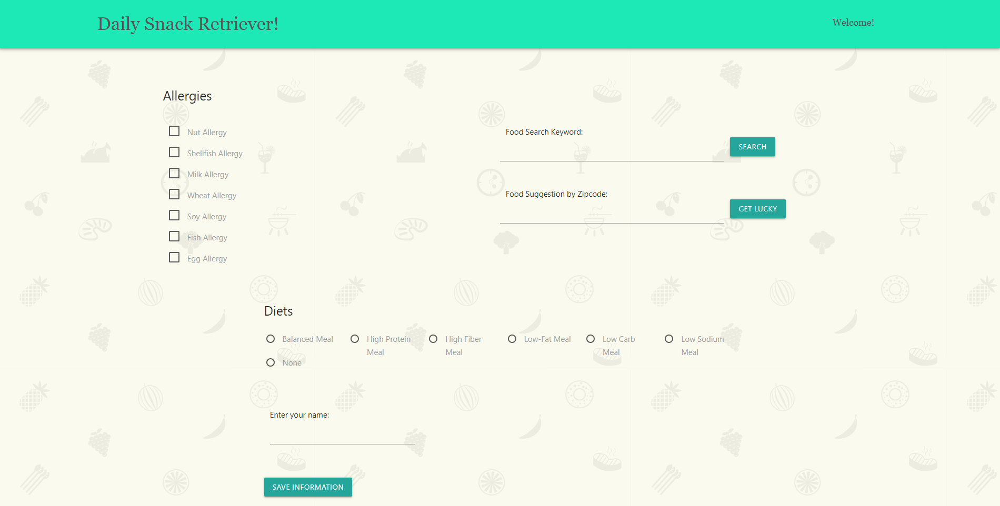

# Daily-Snack-Retrieval

## This project will intake user input such as dietary needs, type of meal, and/or weather. It will output a suggested recipe for at random based on their input. 

## User Story: 
Someone will on a “Heart Healthy Diet” is hungry on a very cold day. They are keeping track of their sodium intake. The website will search for a hot meal. It will check the recipe for it’s sodium content. Once it satisfies these conditions, it will provide a recipe with it’s nutrition facts. 

## Built With:
* jQuery
* Materialize
* JavaScript

## API: 
* Edamam 
* WeatherBit

### Tasks: 
Take in user input and save.
Access weather api to save info.
Recipe api to get recipe.
Filter through recipe.
Display recipe.

## Authors
* Brendan Berry
* Bill Murray
* Carlos Rojas

